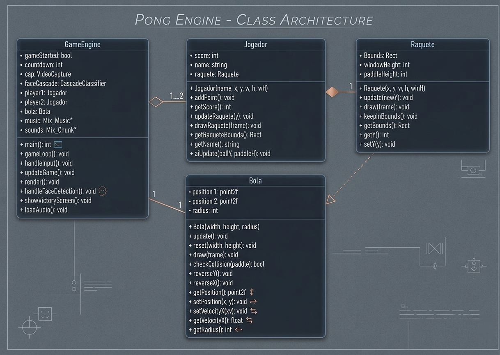

# facePONG

**Integrantes:** Vinicius Figueira, Bruna Evelyn e Maria Jullya Eloi

**Curso:** Engenharia da Computação

**Disciplina:** Linguagem de Programação I

---

## Introdução

O **facePONG** é um jogo interativo de ping pong, controlado apenas pela face do jogador utilizando visão computacional.

Através da captura de vídeo em tempo real, o sistema detecta o movimento do rosto e o utiliza para controlar a raquete dentro do jogo.

---

## Diagrama de Classes


---

## Dependências

* **OpenCV:**

```bash
sudo apt install libopencv-dev
```

* **SDL:**

```bash
sudo apt install libsdl2-dev libsdl2-2.0-0
```

---

## Como jogar:

1. Baixe o repositório:

```bash
git clone git@github.com:jullyaeloi/ProjetoFinalDERZU.git
```

2. Entre na pasta do projeto:

```bash
cd ProjetoFinalDERZU
```

3. Execute o script:

```bash
bash Play.sh
```

ou

```bash
./Play.sh
```

---

## Funcionamento

* A webcam captura o rosto do jogador
* O OpenCV realiza a detecção facial
* O movimento vertical da cabeça controla a raquete
* O objetivo é rebater a bola e marcar pontos

---

## Observações

* É necessário possuir uma webcam funcional
* O ambiente deve ter boa iluminação para melhor detecção facial
* O desempenho pode variar conforme o hardware

---
